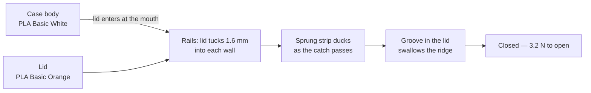
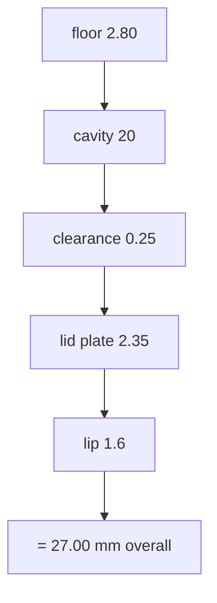

# EasyPick case — v13

## Why this exists

The case TePe supply with the picks is too small — it holds a handful, while a
pack contains far more. I wanted something that holds the whole pack, keeps the
picks safe and clean, and is easy to travel with. Nothing on the market suited
these picks, so I made this.

## What it is

A slide-lid pocket case for TePe EasyPick interdental picks, printed in two
parts on a Bambu Lab A1. The body holds the picks; the lid slides into rails
cut in the side walls and is held shut by a sprung catch at the mouth.

Everything below is generated from the model itself, so the numbers match the
files in this folder.

## Dimensions

| | Width | Length | Height |
|---|---|---|---|
| Outside | 56.0 | 69.0 | 27.0 |
| Cavity | 48 | 61 | 20 |

Cavity volume 58,560 mm³. Case body 30,165 mm³ of material,
lid 10,482 mm³.

## How it goes together

## The height stack

## Features

- **Slide lid, no hinge.** The lid tucks 1.6 mm into each side wall
  under a 1.6 mm lip. The groove roof sits at about
  56° so it prints unsupported.
- **Sprung catch.** A 30 mm strip of the end wall, 1.3 mm
  thick, is freed by a 1.5 mm slot beneath it. It carries a
  0.9 mm ridge giving 0.40 mm of net engagement, about
  3.2 N to open. Without the slot the catch would be rigid and
  would not click at all.
- **Relief at the slot roots.** Ø2.6 holes and a 0.4 mm
  chamfer inside and out, so the strip roots into a radius rather than a square
  corner that would crack.
- **Flush lid panel** with a 0.35 mm shadow gap, ribbed at
  2.4 mm pitch across the slide direction for grip.
- **Flat base.** No bottom chamfer — the full footprint meets the plate, which
  is what fixed the first print pulling loose.
- **Uniform wall.** Every profile is an offset of one outline, so the wall is
  4.0 mm on the flats *and* on the diagonals.
- **2 mm radius** where the floor meets the walls: wipeable, and it
  removes the highest-stress line in the part.

## Printing

| | |
|---|---|
| Printer | Bambu Lab A1, 0.4 nozzle |
| Layer | 0.20 mm |
| Walls | 4 loops |
| Material | PLA Basic — White body, Orange lid (PETG if you want it washable) |
| Supports | None |
| Orientation | Both parts flat, as laid out in the 3MF |
| Brim | 5 mm recommended |

Files: `easypick-case-v13-colour.3mf` carries both parts with filament slots
assigned, `easypick-case-v13.stl` and `easypick-lid-v13.stl` are the same
geometry separately.

## Care

Clean it regularly with warm water, then finish with an alcohol wipe. Don't
submerge it — the spring slot at the mouth is an opening straight into the
cavity, so the case is not sealed against water.

Two things worth knowing if you print it in PLA. Keep the water warm rather than
hot — PLA starts to soften around 55–60 °C, so a dishwasher or a hot tap will
distort it, particularly the sprung strip and the rails. And let it dry fully
before the alcohol wipe, so the alcohol is doing the work rather than diluting
into standing water in the corners.

The 2 mm radius at the floor means a cotton bud or a fingertip in a
cloth reaches the whole inside. The one place nothing will reach is the
1.5 mm spring slot at the mouth — that is the price of a catch that
actually clicks. Printing in PETG instead of PLA lifts the temperature limit
and makes the case properly washable, at the cost of the white-and-orange PLA
Basic pairing.

## Checks run at build time

| Check | Result |
|---|---|
| Case mesh — closed, one body | True |
| Lid mesh — closed, one body | True |
| Lid protruding outside the shell | 0.00 mm³ |
| Interference through the full slide | clear; only the catch, 38.5 mm3 |
| Shipped 3MF vs model volume | 30164.6 / 10482.0 vs 30164.6 / 10482.0 mm3 |

## Revisions

| Version | Change |
|---|---|
| v4 | first restyle: squircle body, fluted band, flush lid panel |
| v5 | square base after the first print lifted off the plate |
| v6 | sprung strip added so the catch has somewhere to flex |
| v7 | uniform wall offsets, lid tail inset, ribbed lid, clearance opened to 0.30 |
| v8 | cavity to 48 x 61 x 20 |
| v9 | relief holes and chamfers at the spring slot roots |
| v10 | clearance tightened to 0.25 after a loose print, catch trimmed to hold 2.8 N |
| v11 | floor dish removed; single build script introduced |
| v12 | 2 mm radius where the floor meets the walls |
| v13 | walls to 4.0 so the outside lands on whole millimetres |
