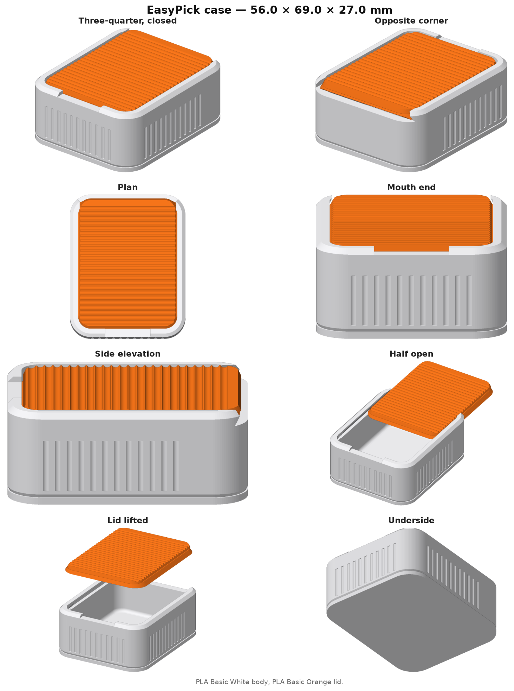
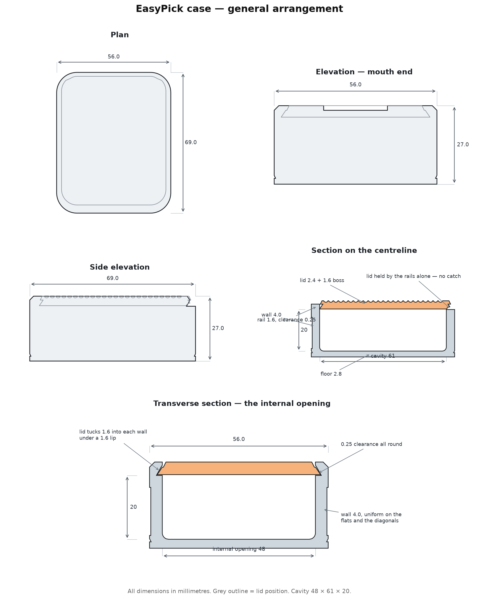
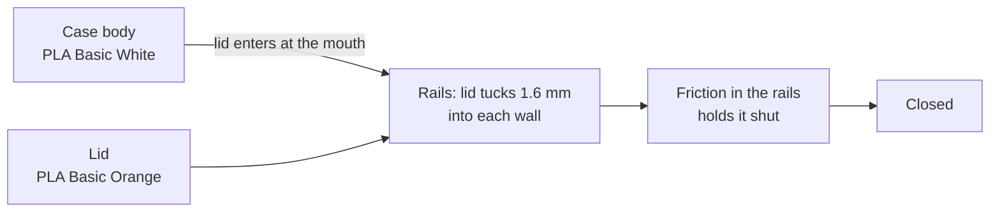
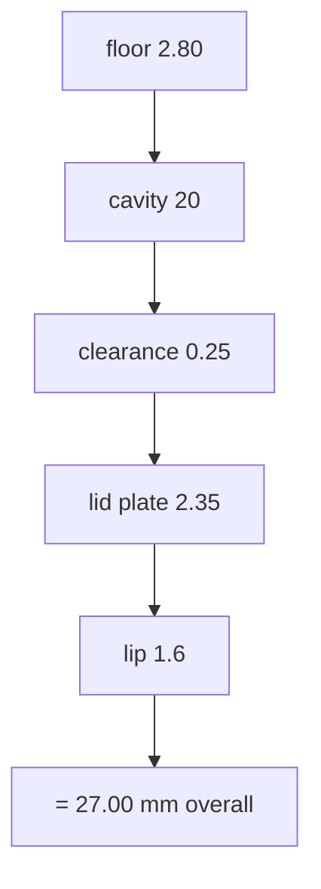

# EasyPick case

## Why this exists

The case TePe supply with the picks is too small — it holds a handful, while a
pack contains far more. I wanted something that holds the whole pack, keeps the
picks safe and clean, and is easy to travel with. Nothing on the market suited
these picks, so I made this.

## What it is

A slide-lid pocket case for TePe EasyPick interdental picks, printed in two
parts on a Bambu Lab A1. The body holds the picks; the lid slides into rails
cut in the side walls and is held shut by friction in those rails.

Everything below is generated from the model itself, so the numbers match the
files in this folder.



## Dimensions

| | Width | Length | Height |
|---|---|---|---|
| Outside | 56.0 | 69.0 | 27.0 |
| Cavity | 48 | 61 | 20 |

Cavity volume 58,560 mm³. Case body 30,253 mm³ of material,
lid 10,482 mm³.



## How it goes together



## The height stack



## Features

- **Slide lid, no hinge.** The lid tucks 1.6 mm into each side wall
  under a 1.6 mm lip. The groove roof sits at about
  56° so it prints unsupported.
- **No catch, and nothing unsupported.** The lid is held by the fit of the
  rails. Earlier revisions used a sprung strip at the mouth, but anything that
  has to deflect downward in a part printed flat needs air beneath it, and that
  strip failed to print twice. Removing it leaves the case with no bridges and
  no overhangs anywhere — it is the reason this revision prints.
- **Running clearance is its own number.** `slide_clr` (0.25 mm) grows only the
  channel cut into the case, so the slide can be tightened or loosened without
  touching the lid.
- **Detent by interference.** The last 6 mm at the deep end of the channel is
  cut 0.24 mm smaller than the lid, so the two must deform slightly to seat, against 0.25 mm of clearance everywhere else.
  Only the lid's leading edge reaches that zone, and only within 6 mm of
  shut, so the case grips the lid closed instead of resisting across the whole
  travel. Nothing about it is unsupported — it is a change of size in a cut
  that already existed.
- **Push notch.** A 22 mm window through the lip at the deep end exposes the
  lid's leading edge so it can be pushed toward the mouth. It is a cut rather
  than an addition, so the case still stands 27.0 mm tall and pockets flat.
- **Flush lid panel** with a 0.35 mm shadow gap, ribbed at
  2.4 mm pitch across the slide direction for grip.
- **Flat base.** No bottom chamfer — the full footprint meets the plate, which
  is what fixed the first print pulling loose.
- **Uniform wall.** Every profile is an offset of one outline, so the wall is
  4.0 mm on the flats *and* on the diagonals.
- **2 mm radius** where the floor meets the walls: wipeable, and it
  removes the highest-stress line in the part.

## Printing

| | |
|---|---|
| Printer | Bambu Lab A1, 0.4 nozzle |
| Layer | 0.20 mm |
| Walls | 4 loops |
| Material | PLA Basic — White body, Orange lid (PETG if you want it washable) |
| Supports | None — the 3MF sets `enable_support` to 0 |
| Orientation | Both parts flat, as laid out in the 3MF |
| Brim | 5 mm recommended |

Files: `easypick-case.3mf` carries both parts with filament slots
assigned, `easypick-case.stl` and `easypick-lid.stl` are the same
geometry separately.

## Care

Clean it regularly with warm water, then finish with an alcohol wipe. Don't
submerge it — the lid slides in an open channel, so the case is not
sealed against water.

Two things worth knowing if you print it in PLA. Keep the water warm rather than
hot — PLA starts to soften around 55–60 °C, so a dishwasher or a hot tap will
distort it, particularly the rails. And let it dry fully
before the alcohol wipe, so the alcohol is doing the work rather than diluting
into standing water in the corners.

The 2 mm radius at the floor means a cotton bud or a fingertip in a
cloth reaches the whole inside. With the spring slot gone there is no longer a
blind pocket anywhere inside. Printing in PETG instead of PLA lifts the temperature limit
and makes the case properly washable, at the cost of the white-and-orange PLA
Basic pairing.

## Checks run at build time

| Check | Result |
|---|---|
| Case mesh — closed, one body | True |
| Lid mesh — closed, one body | True |
| Lid protruding outside the shell | 0.00 mm³ |
| Interference through the full slide | detent grips 6.4 mm3 shut, free by 6 mm, clear beyond |
| Shipped 3MF vs model volume | 30252.7 / 10482.0 vs 30252.7 / 10482.0 mm3 |

Mesh volumes are compared to 0.1 mm³. The triangle counts are not compared:
the boolean and hull libraries tessellate flat regions a few triangles
differently between versions, which changes how the shape is written down and
not the shape itself. `make verify` rebuilds this revision and checks it.

## Repository layout

```
.                             latest revision, aliased in the root
├── README.md                 this file (regenerated every revision)
├── CLAUDE.md                 working rules for the project
├── LICENSE                   CERN-OHL-S v2
├── Makefile                  make vNN — build and ship in one step
├── requirements.txt          pinned build dependencies
├── views.png  schematic.png  latest renders
├── easypick-case.3mf         latest, both parts, filament slots assigned
├── easypick-case.stl
├── easypick-lid.stl
├── revisions/                every version, exactly as shipped
│   └── vNN/                  deliverables + geometry.py it was built from
└── src/                      the generator
    ├── geomNN.py             the model — all parameters live here
    ├── render.py             z-buffer renderer for the views
    ├── build.py              one command: views, schematic, README, 3MF, STLs
    ├── ship.py               copies a build into revisions/ and the root
    └── verify.py             rebuilds a revision and diffs it against shipped
```

Build everything from the model, where NN is the revision:

```
make vNN
```

which is `python3 src/build.py geomNN vNN` followed by the copy into
`revisions/vNN/` and the root. G-code is not kept here — it is tied to the
printer, filament and calibration state, so slice it locally from the 3MF.

## Licence

CERN Open Hardware Licence Version 2 — Strongly Reciprocal (CERN-OHL-S v2).
The full text is in [LICENSE](LICENSE).

You may use, make, modify and sell this design. If you distribute a modified
version — as files or as printed parts — the licence requires you to release
your modified source under CERN-OHL-S v2 as well, and to state what you
changed. Modified designs therefore stay publicly available.

Beyond what the licence requires: if you improve this, please send the change
back so there stays one version everyone benefits from. That is a request, not
a condition.

## Revisions

| Version | Change |
|---|---|
| v4 | first restyle: squircle body, fluted band, flush lid panel |
| v5 | square base after the first print lifted off the plate |
| v6 | sprung strip added so the catch has somewhere to flex |
| v7 | uniform wall offsets, lid tail inset, ribbed lid, clearance opened to 0.30 |
| v8 | cavity to 48 x 61 x 20 |
| v9 | relief holes and chamfers at the spring slot roots |
| v10 | clearance tightened to 0.25 after a loose print, catch trimmed to hold 2.8 N |
| v11 | floor dish removed; single build script introduced |
| v12 | 2 mm radius where the floor meets the walls |
| v13 | walls to 4.0 so the outside lands on whole millimetres |
| v14 | spring slot and catch onto the 0.20 layer grid after the v13 bridge dropped filament; lid geometry untouched |
| v15 | catch removed after the spring failed to print twice — the lid is held by the rails, and nothing in the part is unsupported |
| v16 | v15 slid open too easily: channel tapered tighter over the last 6 mm at the deep end, plus a push notch through the lip |
